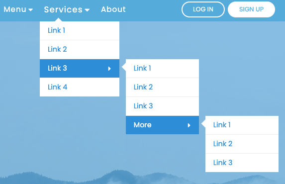
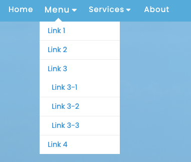
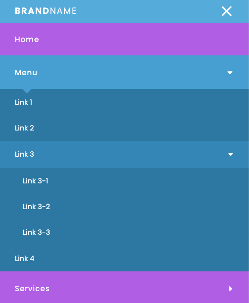

# Responsive-And-Animated-Navbar-With-Multi-level-Drodown
Solve this issue once and for all.

## On desktop you can show multiple levels of dropdowns in staggered manner

## On desktop you can also show the second level of dropdown menu

## On mobile you can reveal multiple levels of dropdowns on clicking

